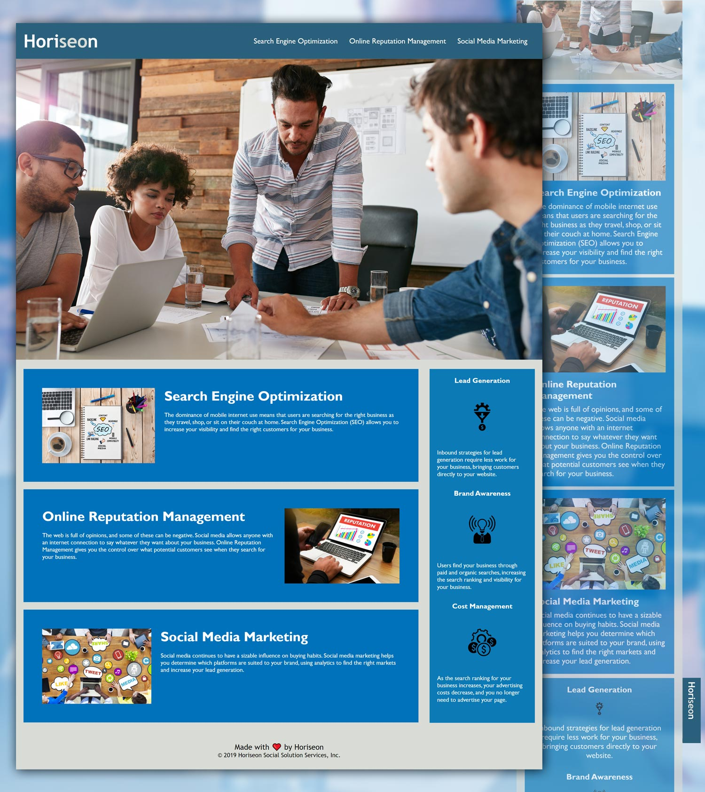

# Hori<i>seo</i>n

## About

Bootcamp week 01: html-css-git challenge: improve webpage source code for better **accessibility**. :blue_heart:

### Task

A *marketing agency* requires a codebase that follows accessibility standards for search engine optimization.

### Solution

Successfully improved the source code so that website meets accessibility standards by completing the following:

- [x] Semantic HTML elements
- [x] HTML elements follow a better logical structure independent of styling and positioning
- [x] All image and icon elements are accessible and contain necessary attributes
- [x] Heading attributes fall in sequential order
- [x] Title elements contain a concise, descriptive title
- [x] Organised style file
- [x] Basic responsiveness

View the project @ **[Horiseon](https://alexandrabatrak.github.io/horiseon/)**

## Credits

Accesibility [report](https://wave.webaim.org/report#/https://alexandrabatrak.github.io/horiseon/) provided by **WAVE** evaluation tool.

## License

Licenced under the [MIT](/LICENSE) license.

*Copyright © 2022 Alexandra Batrak*
